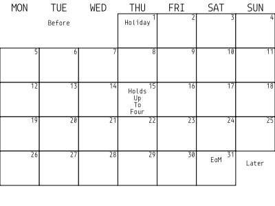

# cal

</img>

Quick PWA to create an image of a calendar to send to a WaveShare passive
NFC ePaper screen (4.2 inches, 400x300 pixels).

This is browser only, requires no backend. You can add it as an "app" to your phone by adding it to your home screen.

Uses [p5js](https://p5js.org) for rendering and [idb-keyval](https://github.com/jakearchibald/idb-keyval) to store locally the current one (and be able to add and remove things easily).

## How it looks

### The UI of the web app

</img>

The UI is minimal and certainly could use some more polish, but should be functional.

- The first selector (`28` to `31`) is for the month length.
- The second selector (`1` to `7`) is for to choose the first weekday of the month (Monday to Sunday).
- Then, a list of month days. 0 is for the last day of the previous month, -1 for the second to last, etc. Numbers higher than the month length are valid, and will show in the available space (within reason, i.e. for a month with up to 5 weeks).
- To have more than one event per day, just add a second one in a different line. Up to 4 should fit with the current font size.
- When typing some text in the last row, a new row will be added.
- Rows can be deleted by pressing the cross. 
- TODO a _delete all_ button could come handy
- Pressing the calendar image will prompt a download, it will look like the one below.
- Changing the length of the month, first weekday of the month or an event text will save the current calendar to IndexedDB in your browser's LocalStorage, so you can keep adding/removing/editing events.

### The resulting calendar

</img>

There are some hardcoded things you may want to tweak:
- Font size for weekdays
- Font size for events
- The font itself (Monoid)

I don't plan on adding customisation for these, if I wanted to change the font I'll just modify it directly. But if you want your own just fork this and tweak whatever you want.

### How it looks on the device

</img>

This is the 4.2 B/W WaveShare passive ePaper, writable via NFC. Even though the generated image is exactly the pixel size of the device, you will need to tweak a bit the brightness/contrast in the WaveShare app.
